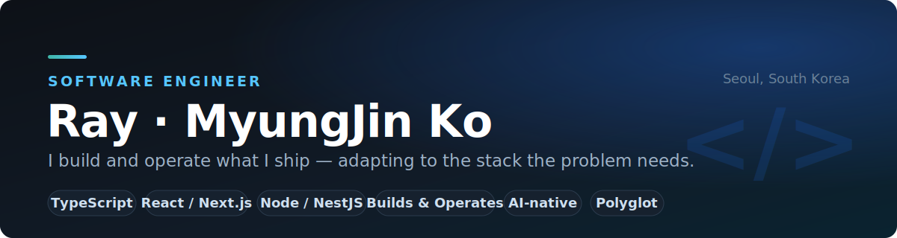
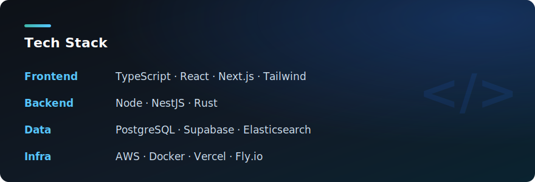

<p align="center">
  
</p>

# Hi 👋, I'm Ray (MyungJin Ko)

### Software engineer who builds and operates what I ship

- 🔭 I'm currently working on **building and operating production-grade full-stack web apps — from React/Next.js interfaces to the cloud infrastructure behind them**
- 🌱 I'm currently learning **system design & software architecture for larger-scale services**
- 🚀 I'm looking to join mission-driven teams or high-growth scale-ups (Series A and beyond) — from world-changing products to deep tech like space and defense
- 🌍 I'm looking to help build global products at real scale
- 🛠 At home in TypeScript on the web — and comfortable crossing into mobile or desktop with whatever each platform calls for
- 📫 How to reach me **rayleighko2@gmail.com · linkedin.com/in/rayleighko**
- 📄 Résumé **[English résumé (PDF)](https://github.com/rayleighko/rayleighko/raw/main/resume.pdf)**
- ⚡ Fun fact **I built and ran a company for 7 years before returning to engineering — and I'm a devoted cat person 🐈**
- 📝 I write at **[ray-k.medium.com](https://ray-k.medium.com)**

```typescript
const ray = {
  name: "MyungJin Ko (Ray)",
  role: "Software Engineer",
  edge: "builds and operates what I ship — adapts to any stack",
  nowChasing: "system design × real-time depth",
  exFounder: true,            // 7 years, took products 0 → 1
  catPerson: true,            // 🐈
  motto: "If things are not failing, you are not innovating enough.",
};
```

### 📌 Featured
<!-- 프로필 'Customize your pins'에서 cohort를 고정하세요 -->
- 🚧 **[Cohort](https://github.com/rayleighko/cohort)** *(building)* — LLM-assisted investment-learning product; my public portfolio project where I apply what I'm learning.
- 🌐 **Personal site** — coming soon

<h3 align="left">Connect with me:</h3>
<p align="left">
<a href="https://github.com/rayleighko" target="blank"></a>
<a href="https://linkedin.com/in/rayleighko" target="blank"></a>
<a href="https://medium.com/@ray-k" target="blank"></a>
<a href="https://leetcode.com/rayleighko" target="blank"></a>
<a href="https://instagram.com/r_a_y_l_e" target="blank"></a>
</p>

<h3 align="left">Tech Stack:</h3>
<p align="left">
  
</p>
<p align="center">
  
</p>
